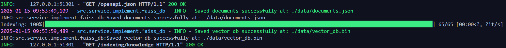
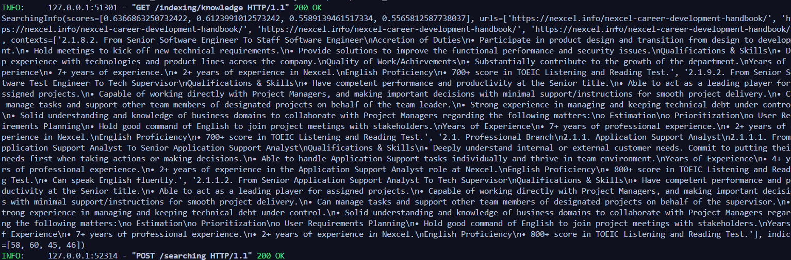
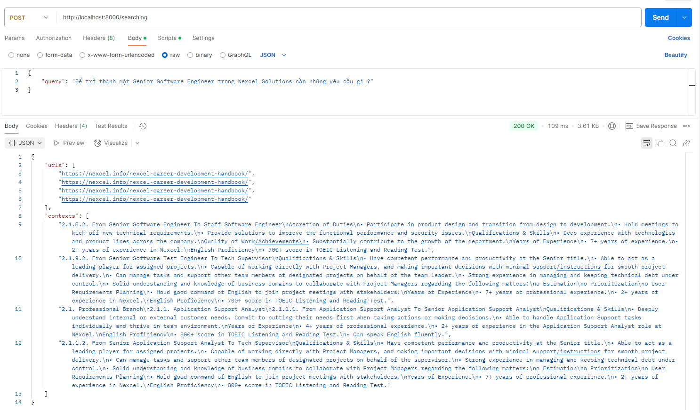

# Tree Folder 

```bash
D:.
│   .dockerignore
│   .gitignore
│   .gitlab-ci.yml
│   crawl4ai_setup.sh
│   Dockerfile
│   main.py
│   README.md
│   requirements.txt
│   run.sh
│
├───config
│       development.yml
│       production.yml
│
├───data
│       documents.json
│       vector_db.bin
│
├───image
│       indexing.png
│       postman_searching.png
│       searching.png
│
├───logs
│       2025-01-06.log
│       2025-01-07.log
│       2025-01-09.log
│       2025-01-15.log
│
└───src
    ├───controller
    │       endpoint.py
    │       endpoint_filter.py
    │
    ├───model
    │       knowledge_info.py
    │       searching_info.py
    │
    ├───module
    │       application_container.py
    │
    ├───notebook
    │       chunking.ipynb
    │       employee_handbook.md
    │       employee_handbook.txt
    │
    ├───service
    │   ├───implement
    │   │       faiss_db.py
    │   │       google_crawler.py
    │   │       halong_embedding.py
    │   │       html_loader.py
    │   │       llama.py
    │   │       markdown_chunking.py
    │   │       naive_rag.py
    │   │       ollama.py
    │   │       vi_mistral.py
    │   │       web_crawler.py
    │   │
    │   └───interface
    │           chunking.py
    │           data_loader.py
    │           llm.py
    │           model_embedding.py
    │           rag.py
    │           vector_database.py
    │           web_crawler.py
    │
    └───utils
            constants.py
            formater.py
            logger.py
            timer.py
            utils.py
```

# Installation

```bash
pip install -r ./requirements.txt
```

# Usage

```bash
bash run.sh
```

***Configure your API in ./config/development.yaml***
```bash
server:
  http:
    host: "0.0.0.0"
    nthreads: 4
    port: 8000
```
***Define your documents and vector database preparing for indexing and searching***
```bash
vector_db:
  path_save_db: "./data/vector_db.bin"
  top_k: 4

knowledge_base:
  url:
    - "https://nexcel.info/employee-handbook-2/"
    - "https://nexcel.info/nexcel-career-development-handbook/"
  path_save_documents: "./data/documents.json"
```

***Step 1: trigger endpoint `/indexing/knowledge` to organize your own database***

After running that endpoint, you will see your `documents.json` and `vector_db.bin` in folder `./data` derived from your configuration `path_save_db` and `path_save_documents`

Now, you can see it running successfully.



***Step 2: provoke endpoint /searching to get the `top_k` relevant documents***

```bash
# Format request to /searching
{
    "query": "Để trở thành một Senior Software Engineer trong Nexcel Solutions cần những yêu cầu gì ?"
}
```

```bash
# Run on terminal
curl -X POST http://localhost:8000/searching \
-H "Content-Type: application/json" \
-d '{
    "query": "Để trở thành một Senior Software Engineer trong Nexcel Solutions cần những yêu cầu gì ?"
}'
```

Now, you can see the result



or in `postman`



